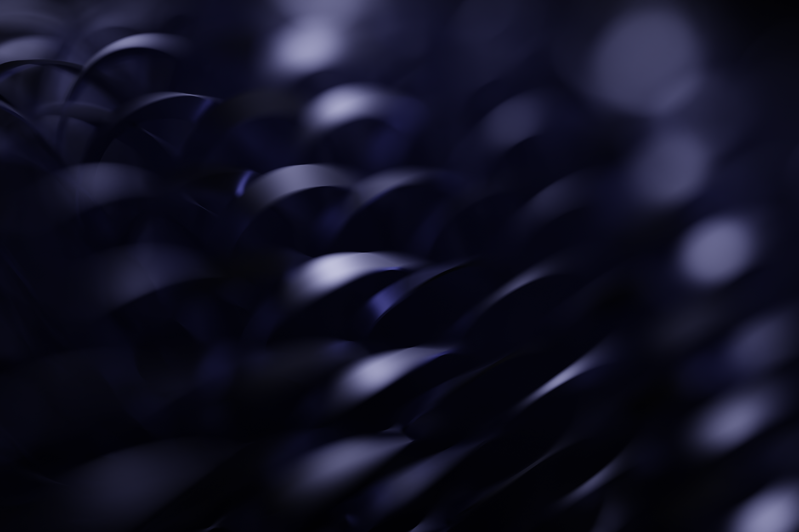

# Wallpapers
I usually open a web browser when I need a new desktop background, but sometimes I open Blender instead.

## Carmel Swirl
{.bg-warning w=200px align=left}
The set up here is pretty simple, but took a lot of trial and error to get dialed in. I used geometry nodes to make a row of lines, rotate the vertices of those lines about the center point, then resample the lines and sweep a tall rectangular profile along their paths. A large area light is placed under the resulting mesh, generating the final image.

This was rendered before Blender had a good solution for smooth normals on geometry nodes' output, so I had to brute force a smooth appearance with an insane poly count. The lighting here is also very dependent on bounces, so it took my 3060 almost half an hour to get a noise-free image. 

## Space Refraction
{.bg-warning w=200px align=left}
Volumetrics are pretty heavy to simulate and render, and the giant curved refractors used to get the distortion effect certainly don't help. No simulation was done here however, just a 3D noise function plugged into the fog density. Because of the refraction planes, point lights show up as bright white spheres that I did not like. I had to strategically place them in the distortion seams to prevent them from being visible.

## Fiber Arches
{.bg-warning w=200px align=left}
I like the way this one looks, but the creation process was incredibly lazy. It's just one instance of an arch with a tweaked default material that's been instanced a bunch of times and placed under a blue spotlight. It took longer to render than it did to make.

## The Great Wallpaper Drought
My main motivation for making my own wallpapers is the feeling that I am starting on a new "iteration" when setting up a new Linux install. I installed Fedora 38 a bit over a year ago, and that install persists to this day despite my best efforts. No new linux install means no demand for a new wallpaper, since I'm pretty settled in as is. I will update this section if I spontaneously decide to make more, probably when Windows 10 reaches EOL and I have to migrate my desktop over to Linux.

One thing a lot of people take for granted with MacOS is the excellent selection of landscapes and abstract art that comes built into the OS. They always depict organic subjects, both in the photos and abstract renders. 